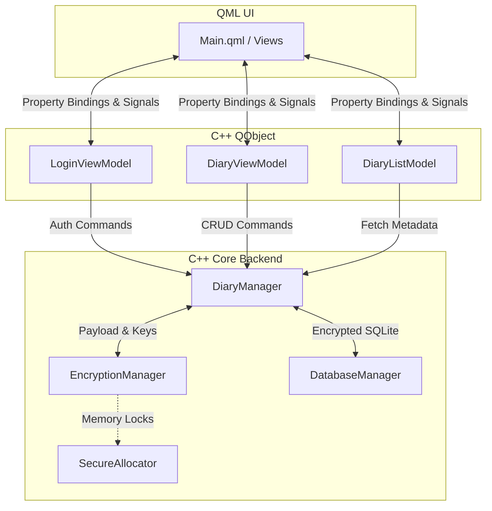

# DCharVault Architecture Overview

## Introduction

DCharVault is an offline-first, highly secure diary and journaling application. It is built using a modern C++20 backend handling business logic and cryptography, and a Qt 6.8 QML frontend for a cross-platform user interface.

The application follows the **Model-View-ViewModel (MVVM)** architectural pattern, which cleanly separates the core security and data handling logic (Model) from the UI presentation (View), with the ViewModel acting as the intermediary.

## Core Architecture (MVVM)

### 1. The Model Layer (`/model`)

The Model layer is responsible for the core business logic, cryptography, secure memory management, and data persistence. It operates independently of the UI framework.

**Key Components:**
* **`DiaryManager`**: The central orchestrator for the application's logic. It coordinates between the database, encryption system, and models. It handles operations like opening the diary, and creating, reading, updating, and deleting entries.
* **`EncryptionManager`**: Wraps Libsodium to provide cryptographic operations. It handles master key derivation (Argon2id), data encryption/decryption (XChaCha20-Poly1305), and salt generation.
* **`DatabaseManager`**: Manages the local SQLite database. It is responsible for storing and retrieving encrypted payloads, and handling database schemas and metadata.
* **`SecureAllocator`**: A custom C++ allocator wrapping Libsodium's memory management (`sodium_malloc` / `sodium_free`) to prevent sensitive data (like keys or plaintext passwords) from being swapped to disk or scraped from RAM.
* **`DiaryEntry` & `EntryMetadata`**: Data structures representing the state and metadata of diary entries.

### 2. The ViewModel Layer (`/viewmodel`)

The ViewModel layer serves as the bridge between the C++ Model and the QML frontend. Classes in this layer inherit from `QObject` and expose properties, signals, and invocable methods to the UI.

**Key Components:**
* **`LoginViewModel`**: Handles the authentication flow, including vault creation and login. It securely passes passwords to the model and updates the UI state based on authentication success or failure.
* **`DiaryViewModel`**: Manages the state and operations for individual diary entries (reading, editing, deleting, saving).
* **`DiaryListModel`**: Inherits from `QAbstractListModel` to provide a model for QML list views (like a list of recent entries). It interacts with `DiaryManager` to load and display entry metadata.
* **`SecurePasswordInput`**: A specialized component for handling password input securely within the UI before it reaches the backend.
* **`ClipboardSanitizer`**: A utility to monitor the system clipboard and securely wipe it after a timeout to prevent sensitive data leakage.

### 3. The View Layer (`/ui` & `Main.qml`)

The View layer consists of QML files that define the user interface. They bind to the properties and methods exposed by the ViewModels. The UI does not directly interact with the Model layer; all interactions go through the ViewModels.

## Data Flow Example: Creating a New Entry

1. **User Input:** The user types a title and content into the UI and clicks "Save".
2. **ViewModel Interaction:** The QML view calls `saveNewEntry()` on the `DiaryViewModel`.
3. **Model Execution:** The `DiaryViewModel` passes the plaintext data to `DiaryManager`.
4. **Processing & Encryption:** `DiaryManager` checks the input. If the title is empty, it securely strips HTML from the content and auto-generates a title. It then passes both the title and content to `EncryptionManager`, which encrypts them using XChaCha20-Poly1305 with the derived master key.
5. **Persistence:** `DiaryManager` sends the encrypted payload to `DatabaseManager`, which saves it to the SQLite database.
6. **UI Update:** The model notifies the `DiaryViewModel` of success, which emits a signal to update the UI.

## Security Guarantees

* **Zero-Knowledge:** The database only stores encrypted data and salts. The master password is never stored or logged.
* **Memory Protection:** Sensitive data (passwords, keys) is managed by `SecureAllocator` to prevent memory scraping.
* **Authenticated Encryption:** Data integrity is guaranteed via XChaCha20-Poly1305.